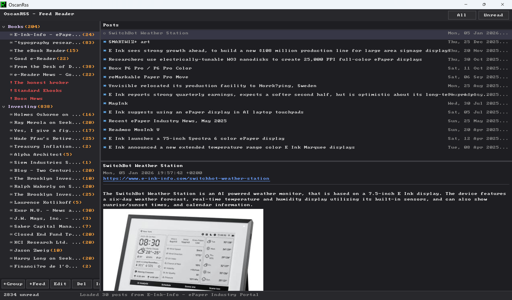

# OscanRss

**A Feedly-style RSS feed reader written in [Oscan](https://github.com/lucabol/Oscan)**



OscanRss is a desktop RSS reader with a three-panel GUI: a treeview of groups and feeds, a post list, and a content viewer with inline HTML rendering. It supports RSS and Atom feeds over HTTP and HTTPS, parallel fetching, OPML import, per-session read tracking, and persistent storage.

## Features

- **Group-based organization** — Organize feeds into groups (Coding, Health, Investing, etc.)
- **CRUD operations** — Create, edit, and delete groups and feeds
- **RSS and Atom** — Both feed formats supported out of the box
- **OPML import** — Bulk-import feeds from a Feedly/Inoreader export (preserves groups)
- **Feed URL auto-discovery** — If a site URL is entered, common alternates are tried (`blog.`, `feeds.`, `rss.`, scheme upgrade, etc.)
- **Parallel startup fetch** — All feeds are refreshed in parallel on launch with a progress bar
- **Failed-feed surfacing** — Feeds that can't be parsed are grouped red at the bottom of their group with a `!` marker
- **Inline HTML rendering** — Article bodies are rendered with basic formatting, links, and images (click to open)
- **Tri-state post filter** — Default *session* view shows posts unread at startup (reads stay visible, greyed); toggle **All** or **Unread** in the chrome to switch
- **Read/unread tracking** — Posts auto-mark read when viewed; toggle with `m`, mark-all with `M`
- **Resizable panes** — Drag the dividers between tree / post list / content
- **Persistent storage** — Groups, feeds, and read state saved to `%APPDATA%` / `$HOME`
- **Keyboard-driven** — Vim-inspired shortcuts for navigation
- **Retro CRT icon** — Phosphor-green "R" window/taskbar icon
- **Cross-platform** — Windows, Linux, macOS (release binaries for all three)

## Prerequisites

- **[Oscan compiler](https://github.com/lucabol/Oscan)** — required
- **`curl`** — used for parallel feed fetching (ships with Windows 10+, macOS, most Linux distros)
- **PowerShell** — for the build script

## Quick Start

```powershell
# Build and run
.\build.ps1 -Run

# Build only
.\build.ps1

# Verbose build
.\build.ps1 -V
```

Pre-built binaries for Windows, Linux, and macOS are attached to each [GitHub release](https://github.com/lucabol/OscanRss/releases).

## Keyboard Shortcuts

| Key | Action |
|-----|--------|
| `j` / `k` | Navigate up/down |
| `n` / `p` | Next/previous post |
| `Enter` | Select / expand group |
| `Tab` | Switch panel focus |
| `a` | Add group or feed |
| `e` | Edit selected item |
| `d` | Delete selected item |
| `r` | Refresh selected feed |
| `R` | Refresh all feeds |
| `u` | Cycle post filter (session → unread → all) |
| `m` | Toggle read/unread |
| `M` | Mark all posts in feed as read |
| `?` | Toggle help overlay |
| `q` | Quit |

## Chrome Buttons

- **+Group / +Feed / Edit / Del** — CRUD on the selection
- **Import** — Import an OPML subscription file
- **All / Unread** — Toggle buttons controlling the post filter. When both are off, the list shows the *session* view: posts that were unread at startup, with posts you read this session kept visible but greyed out (so clicking one doesn't make it vanish)

## Architecture

```
main.osc             Entry point, UI, event loop
├── types.osc        Post / Feed / FeedGroup / AppMode
├── url.osc          URL parsing
├── http.osc         HTTP/HTTPS client + parallel curl fetch
├── rss_parse.osc    RSS + Atom XML parser
├── html_render.osc  Inline HTML rendering, image decode
├── storage.osc      Persistent file storage
├── opml_parse.osc   OPML import
├── icon.osc         Retro CRT "R" window icon
└── libs/ui.osc      UI widget library (buttons, toggles, textbox…)
```

## Data Storage

Configuration and state are stored as flat files in `%APPDATA%` (Windows) or `$HOME` (Linux/macOS):

- `oscanrss_groups.txt` — Group definitions (pipe-delimited)
- `oscanrss_feeds.txt` — Feed subscriptions (pipe-delimited)
- `oscanrss_read.txt` — Read post GUIDs (one per line)

## Building from Source

```powershell
.\build.ps1              # Build
.\build.ps1 -Run         # Build and run
.\build.ps1 -Test        # Run tests
.\build.ps1 -Clean       # Remove build artifacts
.\build.ps1 -V           # Verbose output
```

## License

MIT
